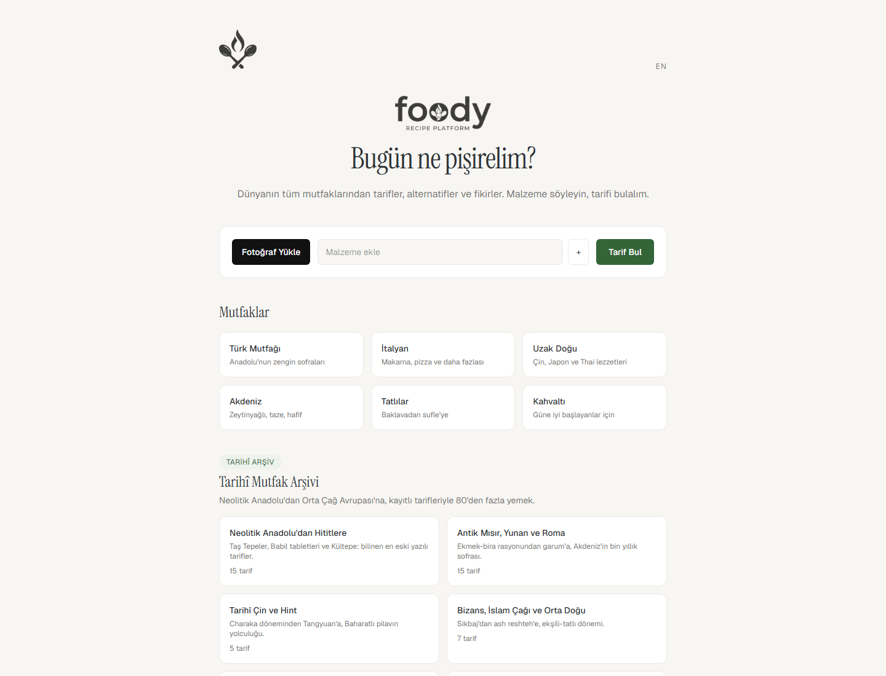
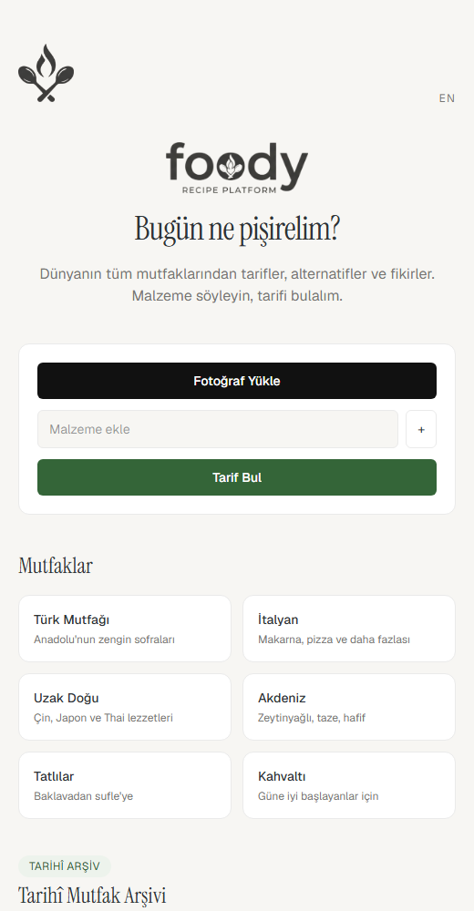
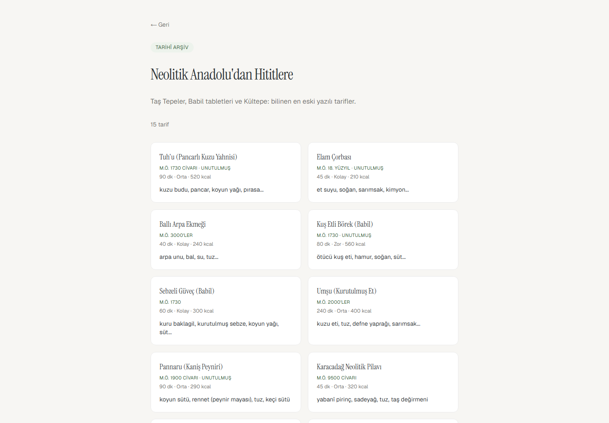
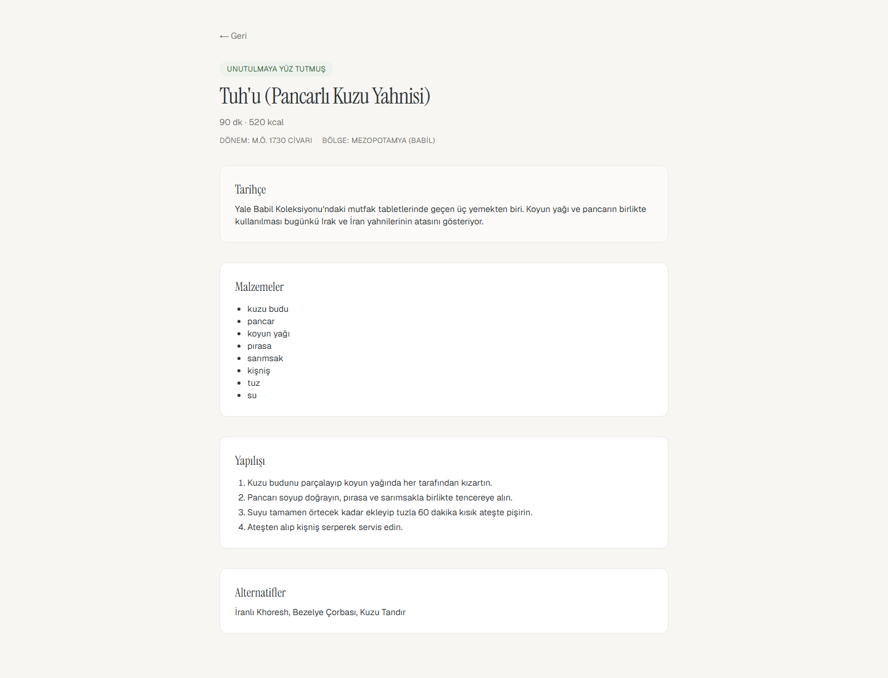

<div align="center">

# foody

**Recipes from every corner of the world — plus an archive of the dishes humanity almost forgot.**

[tr] Dünyanın her mutfağından tarifler ve unutulmaya yüz tutmuş yemeklerin arşivi.

[](https://nextjs.org)
[](https://react.dev)
[](https://www.typescriptlang.org)
[](https://tailwindcss.com)
[](https://eslint.org)
[](https://developer.mozilla.org/en-US/docs/Web/Progressive_web_apps)
[](LICENSE)
[](#contributing)

</div>

---

## Table of contents

- [About](#about)
- [Screenshots](#screenshots)
- [Features](#features)
- [Tech stack](#tech-stack)
- [Architecture](#architecture)
  - [Routing, locales and rendering](#routing-locales-and-rendering)
  - [Data layer](#data-layer)
  - [Service layer: AI abstraction](#service-layer-ai-abstraction)
  - [Internationalisation](#internationalisation)
  - [Splash & motion system](#splash--motion-system)
  - [Progressive web app & roadmap to Android](#progressive-web-app--roadmap-to-android)
  - [Project structure](#project-structure)
- [Getting started](#getting-started)
- [Available scripts](#available-scripts)
- [Environment variables](#environment-variables)
- [Data provenance](#data-provenance)
- [Roadmap](#roadmap)
- [Contributing](#contributing)
- [License](#license)
- [Acknowledgements](#acknowledgements)

---

## About

**foody** is a mobile-first recipe web application built around one idea: you should be able to open a website, tell it what is in your kitchen — by typing or by photographing it — and get a concrete, cookable answer instead of a wall of recipes.

Two datasets live side by side inside the app:

1. **Contemporary recipes** organised by cuisine (Turkish, Italian, Far East, Mediterranean, desserts, breakfast).
2. **The Ancient Kitchen Archive** — 85 researched historical dishes, grouped into 8 eras and regions, each one with a full recipe, an era, a region and a short history. Dishes such as *Tuh'u* (a beetroot and lamb stew recorded on Yale's Babylonian tablets, c. 1730 BCE), *garum* (the Roman fish sauce that vanished from Italy and survived in Southeast Asia), *keşkek/herse* (a Central Asian pounded wheat and meat dish still cooked today), or Erzurum's *demir tatlısı*, a sweet that was baked on a forged iron pan that no longer exists in the city.

**Project maturity:** this repository documents the system as it is designed to evolve. The shipped implementation is an early, working foundation — the splash experience, routing, i18n, data model and UI are production-shaped, while the AI service layer currently runs on a deterministic mock that is designed to be swapped for a real model provider from a single module.

---

## Screenshots

> Screenshots are captured from the production build (`npm run build && npm run start`) and live in [`public/screenshots`](public/screenshots).

| Splash | Home |
| --- | --- |
|  |  |

| Narrow viewport | Historical category |
| --- | --- |
|  |  |

| Recipe detail |
| --- |
|  |

---

## Features

- **Fridge search** — type ingredients as chips or upload a photo; the analysis step is pluggable and currently resolves through the AI abstraction.
- **Ingredient matching** — a scoring service ranks recipes against the ingredients you provide and returns the best matches with alternatives.
- **14 cuisines** — 6 contemporary kitchen categories and 8 historical archive categories.
- **93 recipes** with ingredients, step-by-step instructions (TR/EN), time, difficulty, calories and suggested alternatives.
- **Ancient Kitchen Archive** — era, region, history and a "nearly forgotten" badge for dishes that dropped out of everyday cooking.
- **Bilingual (TR/EN)** — locale-prefixed routing, dictionary-driven UI copy, automatic redirect based on `Accept-Language`.
- **Progressive web app** — web manifest with standalone display, installable on Android and iOS home screens.
- **Motion system** — a splash sequence that runs only on full page loads, plus restrained page transitions, staggered cards and chip micro-interactions.

---

## Tech stack

| Layer | Choice | Version |
| --- | --- | --- |
| Framework | [Next.js](https://nextjs.org) (App Router, Turbopack, `cacheComponents`) | 16.4.0 |
| UI runtime | [React](https://react.dev) / React DOM | 19.3.0 |
| Language | [TypeScript](https://www.typescriptlang.org) | ^5 |
| Styling | [Tailwind CSS](https://tailwindcss.com) (with the Turbopack loader) | ^4 |
| Linting | [ESLint](https://eslint.org) + `eslint-config-next` | ^9 / 16.4.0 |
| Backend (optional) | [Supabase](https://supabase.com) JS + SSR clients | ^2.117 / ^0.12 |
| Packaging | npm, Node.js 20+ | — |

Only `next`, `react` and `react-dom` are hard runtime dependencies. Supabase is optional: without credentials the client is `null` and the UI hides the corresponding features instead of failing.

---

## Architecture

### Routing, locales and rendering

The application is a single App Router tree with a locale segment:

```
src/app/[locale]/
├── layout.tsx        # <html lang>, font variables, global metadata + PWA metadata
├── template.tsx      # per-navigation fade-in wrapper (remounts on every route change)
├── page.tsx          # home (client component)
├── kategori/[slug]/  # cuisine & archive category listing
├── tarif/[id]/       # recipe detail
├── favoriler/        # favourites (UI stage)
└── giris/            # sign-in (UI stage)
```

- **Locale prefix.** Every route lives under `/tr` or `/en`. `src/proxy.ts` (Next.js 16 middleware) intercepts locale-less requests, reads `Accept-Language`, and redirects to `/tr` or `/en` accordingly.
- **Static generation with dynamic fallbacks.** `generateStaticParams` pre-renders every locale, every cuisine and every recipe. `cacheComponents: true` and `partialPrefetching: true` in `next.config.ts` let Next.js ship a prerendered shell and stream the dynamic parts, which keeps first paint fast while the page still reads live data.
- **Navigation transitions.** `template.tsx` wraps every route change in a 220 ms opacity fade. Because a template remounts on navigation, the effect applies per page transition without any client-side router plumbing.

### Data layer

Recipes are static, typed TypeScript data — no database is required to run the app.

```
src/data/
├── types.ts             # Recipe & Cuisine contracts (+ era, region, history, forgotten)
├── recipes.ts           # contemporary recipes, cuisine list, merged exports
├── tarihi-yemekler.ts   # raw historical research notes (name, region, period, ingredients)
└── tarihi/
    ├── index.ts         # archive category list + merged archive recipes
    ├── mezopotamya.ts   # Neolithic Anatolia → Hittites        (15 recipes)
    ├── antik-akdeniz.ts # Ancient Egypt, Greece and Rome       (15 recipes)
    ├── cin-hint.ts      # Ancient China and India              (5 recipes)
    ├── bizans-islam.ts  # Byzantium, Islamic age, Middle East  (7 recipes)
    ├── ortacag-avrupa.ts# Medieval Europe                       (5 recipes)
    ├── turk-anadolu.ts  # Central Asia → Ottoman               (23 recipes)
    ├── erzurum.ts       # The lost kitchens of Erzurum          (7 recipes)
    └── diyarbakir.ts    # The kitchen of Diyarbakır             (8 recipes)
```

Two exports in `src/data/recipes.ts` act as the single read surface for the rest of the app:

```ts
export const allCuisines: Cuisine[];      // 6 contemporary + 8 archive categories
export const recipes: Recipe[];           // 8 contemporary + 85 archive recipes
```

Because search, static params and category listings all read from these merged exports, the archive is a first-class citizen of the product rather than a separate corner — searching for “lamb”, “honey” or “vinegar” surfaces historical dishes next to contemporary ones.

Historical recipes extend the base contract with:

```ts
era?:     { tr: string; en: string };  // e.g. "c. 1730 BCE"
region?:  { tr: string; en: string };  // e.g. "Mesopotamia (Babylon)"
history?: { tr: string; en: string };  // why this dish matters
forgotten?: boolean;                   // nearly lost — drives the badge in the UI
```

### Service layer: AI abstraction

All machine-intelligence calls go through `src/services/ai.ts`, which currently ships a deterministic mock:

| Function | Purpose |
| --- | --- |
| `analyzeImage(file)` | Extracts an ingredient list from a fridge photo. |
| `suggestRecipes(ingredients, query)` | Scores every recipe against the ingredient set and returns the top matches. |
| `askAboutFood(query)` | Answers a free-form food question using recipe metadata. |

The module is the project's designated integration point: adding OpenAI, Gemini or a vision model means implementing the same three function signatures, leaving every component untouched. Ingredients, steps, alternatives, era and history are all plain data, which keeps the future step from being a UI problem — it is a service problem.

### Internationalisation

- `src/i18n/index.ts` exposes `locales`, `Locale`, `Messages` and `getMessages(locale)`.
- `src/i18n/tr.json` and `src/i18n/en.json` hold all UI copy; Turkish is the source of truth.
- Localised content (recipe names, steps, era, history) uses inline `{ tr, en }` pairs inside the data files, so a dish is defined once and rendered in both languages.
- Both JSON dictionaries must stay in sync — a missing key falls back to Turkish at runtime, but the build should be the place where that is caught.

### Splash & motion system

The splash screen is a small piece of deliberate engineering:

- **Runs once per real visit.** `src/lib/splashState.ts` keeps a module-level flag. A full page load re-evaluates the module (splash plays), while client-side navigation keeps it alive (splash is skipped).
- **Renders correctly before CSS arrives.** The splash overlay, logo and loading track are positioned with inline styles rather than utility classes. Tailwind chunks can arrive after first paint; inline styles ship inside the HTML, so the logo never flashes in an unstyled position.
- **Continuous motion.** The background fades independently while the *same* `` element travels from the viewport centre to its final hero position — one element, one transform, no swap and no re-entry.
- **A single dot, not a sliding bar.** The loading indicator is a 12 px dot moving left–right inside a thin rounded track (`barDot`, 1.2 s, easing in-out).
- **Total time budget ~2.5 s** — a single loop of the dot, then the exit transition.

The rest of the motion system is deliberately restrained: page transitions (220 ms fade), staggered recipe cards (50 ms increments), chip entry (180 ms scale + fade) and hover lifts on cards. Everything animates `opacity` or `transform` only, which keeps the work on the compositor and the site smooth on mid-range Android devices.

### Progressive web app & roadmap to Android

`public/manifest.json` (standalone display, theme colour, `/tr` start URL) plus the Apple web-app metadata in `layout.tsx` make the site installable. The Android path is deliberately staged:

1. Installable PWA today (add to home screen, standalone window).
2. Capacitor shell wrapping the same build for Play Store distribution.
3. Camera capture through the native bridge for the fridge-photo flow, instead of the browser file input.

No platform-specific code is required for this path — the current feature set is standard web.

### Project structure

```
foody/
├── public/
│   ├── assets/            # logo set (optimised + source variants)
│   ├── screenshots/       # documentation screenshots
│   └── manifest.json      # PWA manifest
├── src/
│   ├── app/[locale]/      # App Router tree (see Routing)
│   ├── components/        # HomeClient, FridgeSearch, RecipeCards
│   ├── data/              # recipes, types, historical archive
│   ├── i18n/              # locale plumbing + TR/EN dictionaries
│   ├── lib/               # splash state, optional Supabase client
│   ├── services/          # ai.ts — the AI abstraction boundary
│   └── proxy.ts           # locale redirect middleware
├── CONTRIBUTING.md
├── LICENSE
└── next.config.ts
```

---

## Getting started

**Prerequisites:** Node.js 20+ and npm 10+.

```bash
# 1. install dependencies
npm install

# 2. start the development server (Turbopack)
npm run dev
```

Open [http://localhost:3000](http://localhost:3000) — you will be redirected to `/tr` (or `/en` depending on your browser language).

**Testing on a phone on the same network**

```bash
npm run dev
```

Then open `http://<your-lan-ip>:3000` on the device. Next.js blocks dev-only requests from unknown hostnames, so the LAN address is declared in `next.config.ts`:

```ts
allowedDevOrigins: ["192.168.1.67", "192.168.1.*"],
```

Add your own address there if your network changes.

**Production build**

```bash
npm run build
npm run start
```

---

## Available scripts

| Script | Description |
| --- | --- |
| `npm run dev` | Development server with Turbopack and hot reloading. |
| `npm run build` | Production build; also type-checks the project. |
| `npm run start` | Serves the production build. |
| `npm run lint` | ESLint over the project. |

---

## Environment variables

Both are optional — the app runs fully without them.

| Variable | Purpose |
| --- | --- |
| `NEXT_PUBLIC_SUPABASE_URL` | Supabase project URL. |
| `NEXT_PUBLIC_SUPABASE_ANON_KEY` | Supabase anonymous key. |

When unset, `src/lib/supabase.ts` returns `null` and auth-dependent UI stays hidden instead of throwing. No secret keys belong in this repository.

---

## Data provenance

The historical archive is a research product, not a generated one.

- `src/data/tarihi-yemekler.ts` holds the raw notes (dish, region, period, ingredients, notes).
- `yemek-arsivi.md` documents the era-by-era findings and the sources behind them — Babylonian culinary tablets, Kültepe merchant archives, Hittite cuneiform, Apicius and Cato, Chinese and Indian textual sources, and Turkish documentation such as *Dīwān Lughāt al-Türk* and regional heritage projects.

Historical recipes in `src/data/tarihi/` are practical reconstructions: ingredient lists and techniques follow the sources, while quantities, timings and instructions are adapted to a modern kitchen.

---

## Roadmap

- [x] App Router foundation, locale routing and bilingual UI
- [x] Fridge-photo and ingredient search flow
- [x] Contemporary recipe catalogue with detail pages
- [x] Ancient Kitchen Archive (85 recipes, 8 categories)
- [x] Splash experience and restrained motion system
- [x] PWA manifest and LAN-safe development setup
- [ ] Real AI provider behind `src/services/ai.ts` (vision + recipe reasoning)
- [ ] Supabase persistence: accounts, favourites, recipe submissions
- [ ] Android release via Capacitor, native camera capture
- [ ] Recipe images, difficulty scaling by serving count, ratings
- [ ] Nutrition and cost estimation, shopping list generation
- [ ] Cooking mode with timers, step-by-step guidance

---

## Contributing

Contributions are welcome — see [CONTRIBUTING.md](CONTRIBUTING.md) for the workflow, the data contracts, and the translation rules.

---

## License

Released under the Apache License 2.0. See [LICENSE](LICENSE).

---

## Acknowledgements

- To the archaeologists, philologists and heritage projects that made the ancient recipes in this repository possible — the sources are listed in [`yemek-arsivi.md`](yemek-arsivi.md).
- Built with [Next.js](https://nextjs.org), [React](https://react.dev), [Tailwind CSS](https://tailwindcss.com) and [TypeScript](https://www.typescriptlang.org).